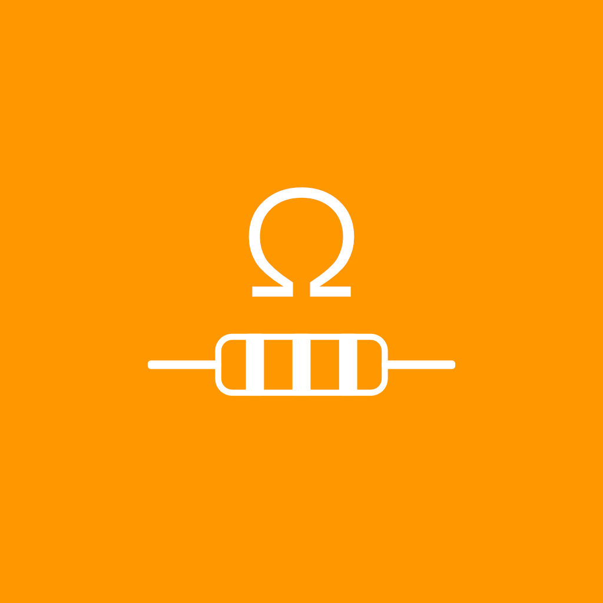

# Resistor Vision

<div align="center">
  
  
  **Natychmiastowe rozpoznawanie wartości rezystorów za pomocą kamery smartfona**
</div>

---

## Funkcje

- **Rozpoznawanie kamerą** - Skanuj rezystory z detekcją pasków kolorowych opartą na uczeniu maszynowym
- **Wprowadzanie ręczne** - Wybierz kolory ręcznie dla precyzyjnych obliczeń
- **Tryb ciemny** - Pełne wsparcie dla jasnego i ciemnego motywu
- **Wielojęzyczność** - Dostępna w języku polskim i angielskim
- **Obsługa rezystorów 3-6 pasmowych** - Obliczanie rezystancji z różnymi tolerancjami
- **Detekcja w czasie rzeczywistym** - Natychmiastowe wyniki dzięki zaawansowanemu modelowi AI
- **Dokładność** - Wytrenowany model ML do precyzyjnego rozpoznawania kolorów

## Jak to działa

1. **Zakładka Home** - Ręcznie wybierz liczbę pasków i kolory, aby obliczyć rezystancję
2. **Zakładka Vision** - Skieruj kamerę na rezystor i naciśnij "Rozpoznaj Rezystor" dla automatycznej detekcji
3. **Edycja wyników** - Przenieś wyniki z kamery do zakładki Home w celu dostrojenia

## Stack technologiczny

- **React Native** 0.76 z Expo SDK 54
- **TensorFlow Lite** do wnioskowania ML na urządzeniu
- **React Native Vision Camera** do przetwarzania obrazu z kamery
- **Frame Processors** (JSI) do analizy obrazu w czasie rzeczywistym
- **Expo Router** do nawigacji
- **i18next** do internacjonalizacji


## Model ML

Aplikacja wykorzystuje dwa niestandardowe modele TensorFlow Lite:
1. **Model detekcji rezystora** - Identyfikuje położenie rezystora w kadrze
2. **Model rozpoznawania kolorów** - Wykrywa poszczególne paski kolorowe (obsługuje 12 kolorów: czarny, brązowy, czerwony, pomarańczowy, żółty, zielony, niebieski, fioletowy, szary, biały, złoty, srebrny)

## Rozwój projektu


### Instalacja

```bash
# Sklonuj repozytorium
git clone https://github.com/chubos/resistorvision.git

# Przejdź do katalogu projektu
cd resistorvision

# Zainstaluj zależności
npm install

# Uruchom serwer deweloperski
npx expo start
```

### Budowanie

```bash
# Build dla Android (APK)
npx eas-cli build --platform android --profile preview

# Build produkcyjny (AAB)
npx eas-cli build --platform android --profile production
```

## Pobierz

[Link do Google Play Store - Wkrótce]

## Prywatność

Resistor Vision szanuje Twoją prywatność:
- Brak zbierania danych
- Całe przetwarzanie odbywa się na urządzeniu
- Nie wymaga połączenia z internetem (po instalacji)
- Dostęp do kamery tylko podczas korzystania z funkcji Vision

